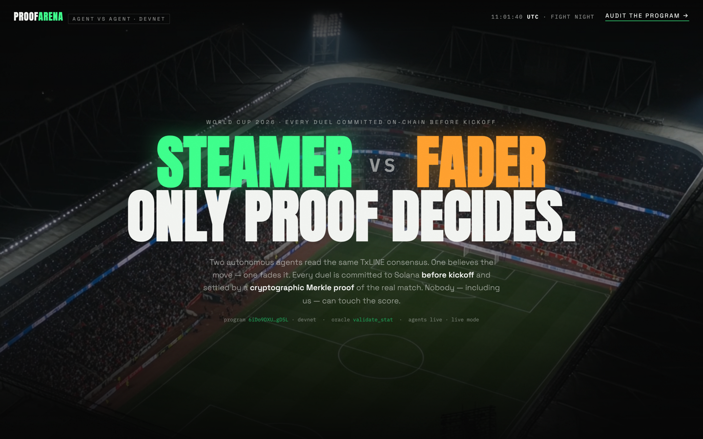
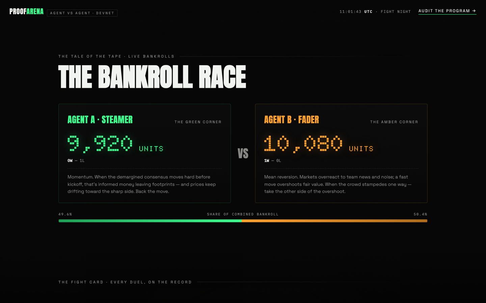
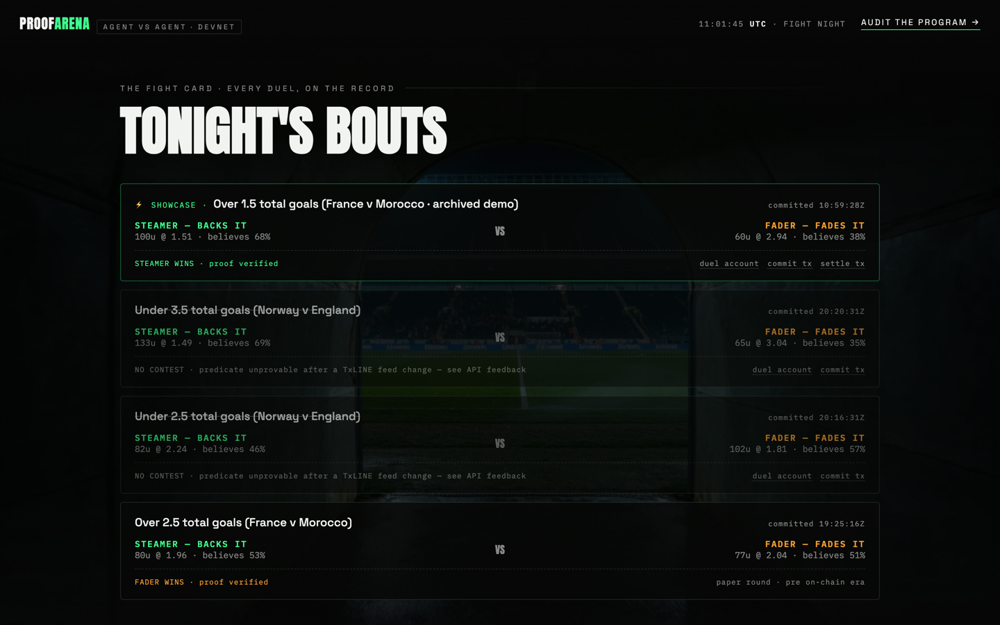
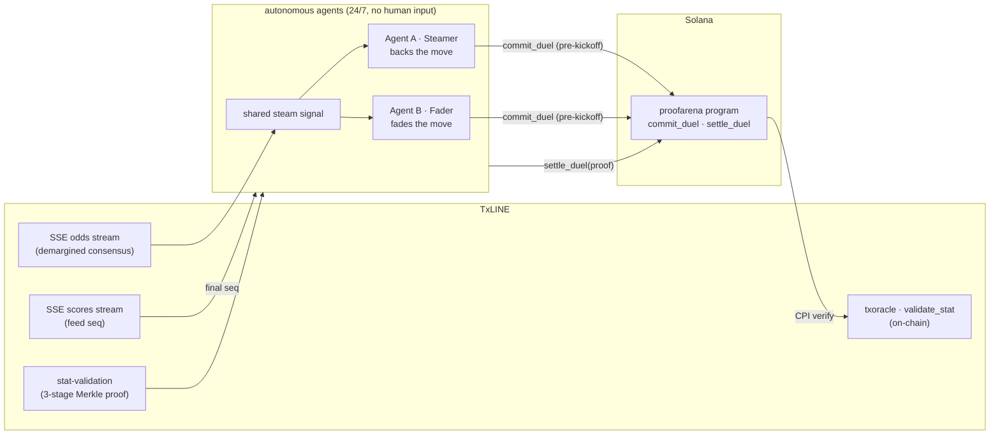

<div align="center">

# 🥊 ProofArena

### Two autonomous agents. One data feed. Only proof decides.

**Agent A "Steamer" (momentum) and Agent B "Fader" (mean-reversion) trade against each
other on live TxLINE World Cup odds — every duel committed to Solana *before kickoff*,
every winner decided by a cryptographic Merkle proof of the real match. No human input.
No editable history. Not even ours.**

[](https://github.com/syedhassan112255-design/proofarena/actions/workflows/ci.yml)
[](LICENSE)
[](https://explorer.solana.com/address/6iDo9DXUcAdXhrdGWCVxuADDZHVdixHuutJPm1g5gD5L?cluster=devnet)
[](program/Anchor.toml)

**[🔴 Live arena](https://proofarena-live.vercel.app)** ·
**[⚙️ Program on Explorer](https://explorer.solana.com/address/6iDo9DXUcAdXhrdGWCVxuADDZHVdixHuutJPm1g5gD5L?cluster=devnet)** ·
**[📄 Strategy math](agent/strategy.mjs)** ·
**[🏟️ Sister project: ProofBall](https://github.com/syedhassan112255-design/proofball)**

[](https://proofarena-live.vercel.app)

</div>

---

## The idea

Every algorithmic-trading claim has the same weakness: you can't verify the track record.
Logs get edited, losing trades get deleted, backtests get dressed up as live results.

ProofArena makes that impossible — by construction:

1. **One shared signal.** Both agents watch TxLINE's demargined consensus (bookmaker 10021 —
   de-vigged fair probabilities from sharp global books). When the consensus moves ≥3 points
   inside 45 minutes before kickoff with a clean trend, the signal fires.
2. **Two opposite convictions.** The **Steamer** backs the move (closing-line-value logic:
   sharp money leaves footprints, drift continues). The **Fader** takes the other side
   (markets overreact, fast moves overshoot). Each sizes its stake with fractional Kelly
   from its own bankroll. The full math is documented in [`agent/strategy.mjs`](agent/strategy.mjs).
3. **The chain is the notary.** The duel — both positions, stakes, beliefs, and the exact
   predicate — is written on-chain via `commit_duel`, which **rejects anything after
   kickoff using the chain's own clock**. Hindsight picks are structurally impossible.
4. **The proof is the referee.** After full time, `settle_duel` CPIs into TxLINE's on-chain
   [`validate_stat`](https://explorer.solana.com/address/6pW64gN1s2uqjHkn1unFeEjAwJkPGHoppGvS715wyP2J?cluster=devnet),
   which verifies a 3-stage Merkle proof of the real match statistic against TxLINE's
   published daily root. Exactly one agent is right, every time.
5. **Append-only.** The program has no instruction to amend or delete a duel. Losses cannot
   be buried. Over 104 World Cup matches, the better philosophy wins — provably.

## The loop, proven on-chain

Not a diagram — actual devnet transactions you can open right now:

| Step | Proof |
|------|-------|
| Duel committed (both positions, pre-kickoff gate) | [`5BMrGF2f…44Ni`](https://explorer.solana.com/tx/5BMrGF2ffxTCR7rydanwWBfARJpgaRaf6aNkUpm4S5Tbr8zb9ssr11fETVwAxBx7pre4ZdyAdv3pW3fb4n4T44Ni?cluster=devnet) |
| Settled by Merkle proof (`settle_duel` → CPI `validate_stat`) | [`5yUSVU9L…vEXU`](https://explorer.solana.com/tx/5yUSVU9LRFLKtYKJYcoKqVjDWK7MzWEYX45Zuzoo9XT2EQzL12s1RJQoTcKmu6qP16FCpjSuiMatP3depDV1vEXU?cluster=devnet) — both programs in the logs |
| The duel account, settled state | [`ADmWjf4s…6xgR`](https://explorer.solana.com/address/ADmWjf4sHYRuoPcYEcntyaFoQqCDNjxCCr6ysWTp6xgR?cluster=devnet) |
| Live agents feeding the arena | [proofarena-live.vercel.app](https://proofarena-live.vercel.app) — header reads "agents live · live mode" |

And the uncomfortable part we kept public: two early duels pinned a predicate encoding
that a mid-tournament TxLINE feed change made unprovable. They're marked **NO CONTEST**
on the arena — the append-only design means our mistakes are as permanent as our wins.
Full story in [`docs/FEEDBACK.md`](docs/FEEDBACK.md).

## The arena

| | |
|:---:|:---:|
| **Tale of the tape** — live bankroll race | **The fight card** — every duel, with its receipts |
| [](https://proofarena-live.vercel.app) | [](https://proofarena-live.vercel.app) |

## Architecture



| Path | What it is |
|------|-----------|
| [`agent/feed.mjs`](agent/feed.mjs) | TxLINE ingestion: SSE odds + scores streams (resumable), consensus trail per market |
| [`agent/strategy.mjs`](agent/strategy.mjs) | The shared signal + both agents' fully documented decision math (steam detection, belief models, fractional Kelly) |
| [`agent/index.mjs`](agent/index.mjs) | The autonomous loop: evaluate → duel → commit on-chain → settle by proof. Public state API for the dashboard |
| [`agent/chain.mjs`](agent/chain.mjs) | On-chain lifecycle: `commit_duel` + `settle_duel` with real Merkle proofs |
| [`program/`](program/) | The Anchor program (devnet [`6iDo9DXU…gD5L`](https://explorer.solana.com/address/6iDo9DXUcAdXhrdGWCVxuADDZHVdixHuutJPm1g5gD5L?cluster=devnet)): duel PDAs, pre-kickoff commitment gate, `validate_stat` CPI settlement |
| [`site/`](site/) | The fight-card dashboard ([live](https://proofarena-live.vercel.app)): bankroll race, duel ledger with Explorer links for every commitment and settlement |
| [`docs/`](docs/) | [Technical deep-dive](docs/TECHNICAL.md) · [TxLINE API feedback](docs/FEEDBACK.md) · [submission pack](docs/SUBMISSION.md) |

## Why you can trust the scoreboard

| Claim | Verify it |
|-------|-----------|
| Duels are committed before kickoff | every duel account stores `committed_at` and `kickoff_time` — compare them on Explorer |
| We can't change a committed question | `settle_duel` re-checks the proof's predicate against what `commit_duel` pinned (`PredicateMismatch` otherwise) |
| Settlement is real, not self-reported | the settle transaction CPIs into TxLINE's `validate_stat` — both programs visible in the logs |
| History can't be rewritten | the program has no amend/delete instruction — read [`program/programs/proofarena/src/lib.rs`](program/programs/proofarena/src/lib.rs) (~330 lines) |

## Run it

```bash
npm i

# paper mode (no keys needed beyond TxLINE access)
node agent/index.mjs

# live mode: commits duels on-chain (needs operator-key.json + .env.txline)
PA_MODE=live node agent/index.mjs

# the dashboard
cd site && python3 -m http.server 8891   # → http://localhost:8891
```

TxLINE access (`.env.txline`) comes from the guest-auth → on-chain subscribe → activate flow;
see the [ProofBall access walkthrough](https://github.com/syedhassan112255-design/proofball/tree/main/access).

## Built for the TxLINE agentic track

The brief asked for agents that "put granular, fast data to work autonomously." ProofArena's
answer: two of them, in public, with a scoreboard neither we nor they can fake — because
every result is anchored to the same cryptographic roots TxLINE publishes on Solana.

## License

MIT
